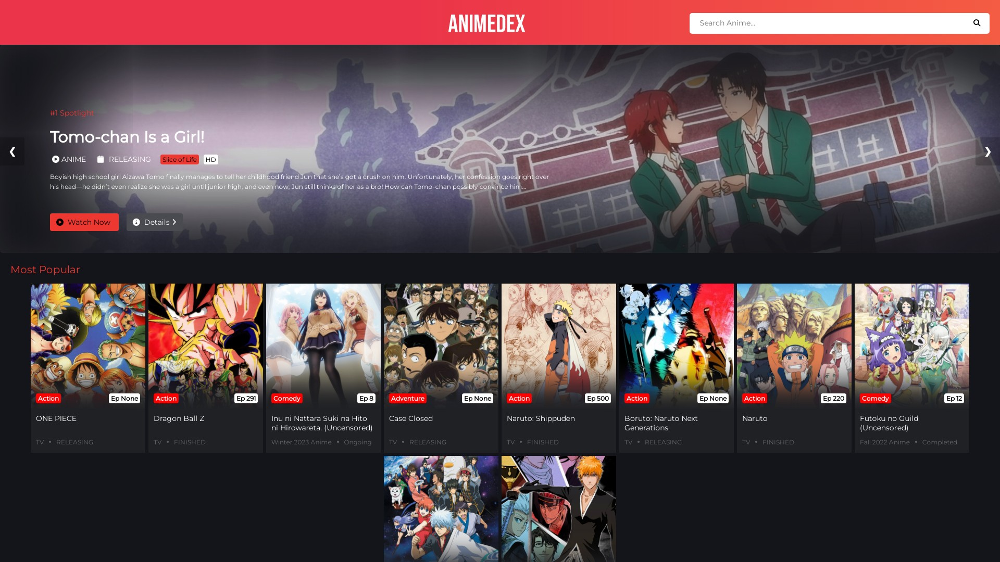
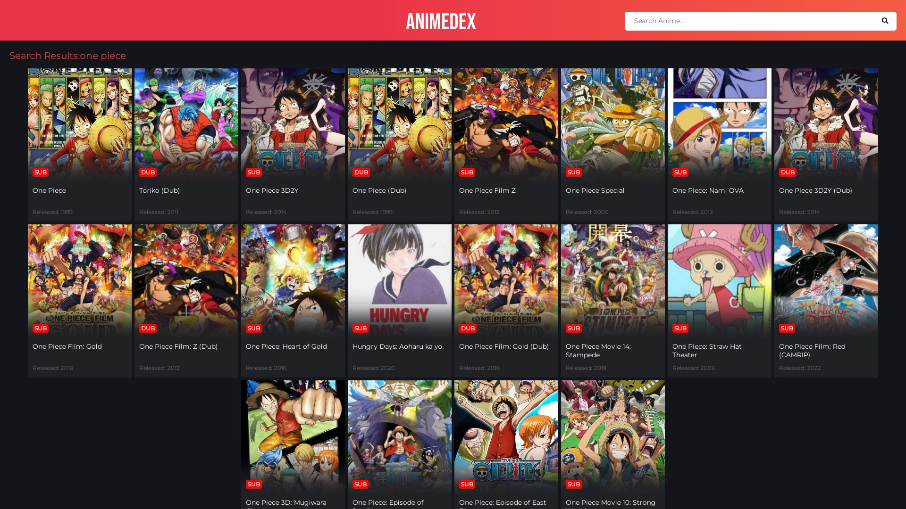
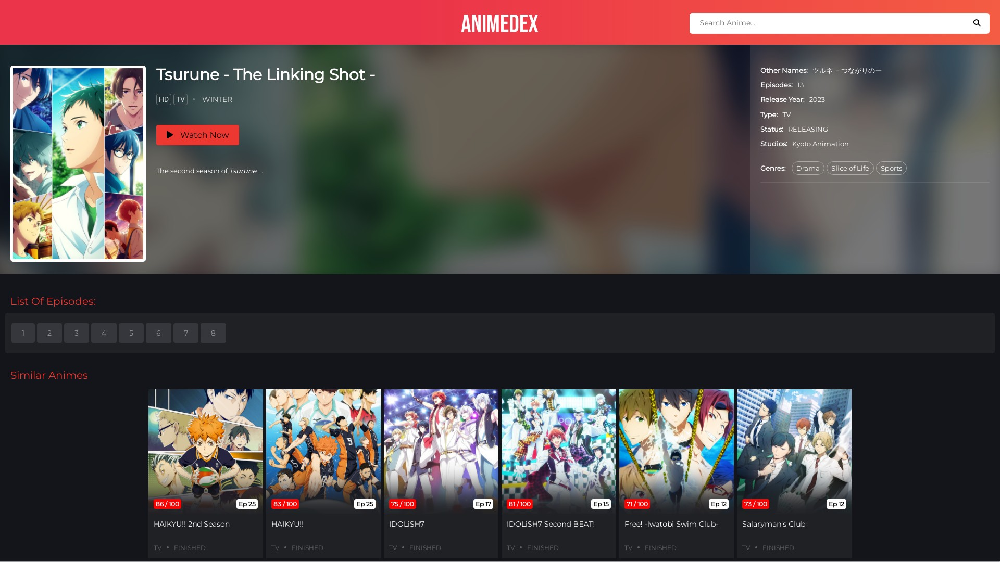
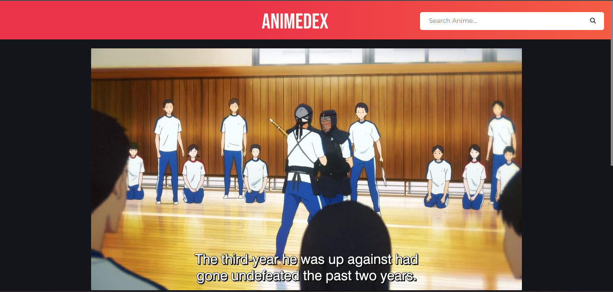

<h1 align="center"><a href="https://home.animedex.live"></a></h1>
<h2 align="center"><a href="https://home.animedex.live"><b>Watch Animes Online For Free</b></a></h4>

<hr>

### Join For Latest Updates

[](https://telegram.me/TechZBots) [](https://telegram.me/TechZBots_Support)

<hr>

- Built With Flask In Python
- Fast And Responsive
- Uses Anilist To Get Data
- And GoGo Anime For Episodes
- Can Be Deployed To Vercel.com And Repl.it OR Any Other Hosting Service
> Website : https://home.animedex.live

> Powered By TechZApi

<hr>

### ♻️ Get TechZApi

- Get from @TechZApiBot on Telegram | https://t.me/TechZApiBot
- Fill this in env or in config.py
- Facing any issues let us know at https://t.me/TechZBots_Support

<hr>

### ⚡️ Deploy Your Own

- Click Below To Deploy On Vercel

  []([https://vercel.com/animxer18/anim-xer4](https://vercel.com/animxer18/anim-xer4)
    - Demo : https://home.animedex.live

- Deploy To Repl.it

    - Fork This Repl To Your Account : https://replit.com/@ShreyashDheemar/AnimeDex
    
    - Fill your TechZApi Key in config.py

    - Demo : https://animedex.shreyashdheemar.repl.co

- Deploy To Heroku
  
  <a href="https://www.heroku.com/deploy/?template=https://github.com/TechShreyash/AnimeDex" target="_blank"></a>

- Deploy On Server
  - Install Requirements
    
    ```pip3 install -r requirements.txt```
  
  - Fill you TechZApi Key in config.py
  - Start The Website

    ```python3 main.py```
  - Demo : https://home.animedex.live

  - Need Guide : 
    - https://docs.digitalocean.com/tutorials/app-deploy-flask-app/
    - https://flask.palletsprojects.com/en/2.0.x/deploying/

<hr>

### 📸 Screenshots

<br>









<hr>


### 👤 Contact Me

[](https://telegram.me/TechZBots) [](https://telegram.me/TechZBots_Support)

<hr>

### ⭐ Credits

* [TechZBots](https://t.me/TechZBots)
* [TechShreyash](https://github.com/TechShreyash)

### ⛑ Important

* [License](https://github.com/TechShreyash/AnimeDex/blob/main/LICENSE)
